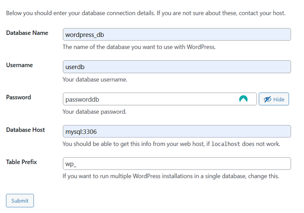

# Excercise: Docker
``Author:`` Michael Maximilian Werfring

``Course:`` Software Deployment - ILV

``Repo:`` https://github.com/MichaelWerfring/software-deployment/tree/main/lab3

Both of the folders ``\part-1`` and ``\part-2``
 are built to host wordpress and mysql in separate containers. 
Before starting/building them make sure the docker daemon is running by starting Docker Desktop.

## Part 1 
This part of the excercise is just a Docker file using the official wordpress and mysql images, it can be use by typing 

```
cd part-1
docker compose up
```

Wordpress can be found on https://localhost:8000 while mysql is running on port 3306. Both of the images are using volumes, persist all the data.


## Part 2

This part consists of 2 Dockerfiles one for creating a mysql image based on debian and the other one for creating an apache server hosting wordpress. 
They can be set up using: 
```
cd part-2

docker compose up --build
// or 
docker compose up 
```

The Wordpress Website will be accessible from port ``80`` and mysql database on ``3306``

The containers are both in the ``wpsite`` network, and are configured in a way that they can communicate propperly.

In the current setup the mysql database is configured like this: 
``database``: wordpress
``user``: user
```password``: password

It can be configured in the wordpress UI like this:

