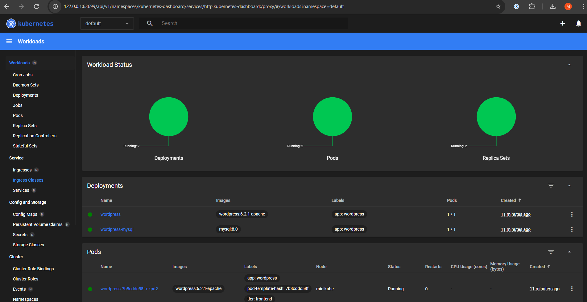

# Softwaredeployment Lab4

Minikube has been used for this exercise and the minikube dasboard addon has been used to manage the cluster.


## Deloyment 
ALl the files needed to deploy wordpress and myslq are within this folder. The deployment has been set up according to [the Kubernetes documentation](https://kubernetes.io/docs/tutorials/stateful-application/mysql-wordpress-persistent-volume/) and Kubernetes secretes were leveraged to set the myslq database password in kustomization.yaml which can be changed as needed. The following commands have to be executed to deploy wordpress and mysql:

```
minikube start
kubectl apply -k ./
```

To validate setup, the following commands can be used: 

```
kubectl get secrets
kubectl get pvc
kubectl get pods
kubectl get services wordpress
```

To get the IP-Address of the wordpress instance use: 
```
minikube service wordpress --url
```